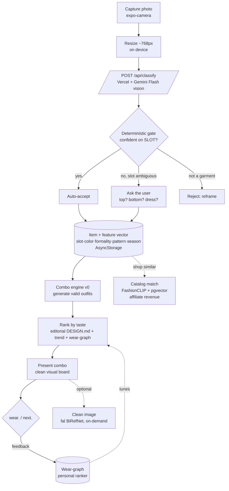

# StyleMeUp — System Design & Architecture

Last updated: 2026-06-19. The app-side architecture (complements
`the-edit`'s pipeline diagram in `learning/the-edit-architecture/`). Written
to be shown in an interview: every box has a **what** and a **why**.

---

## 0. One-paragraph system

StyleMeUp is an **Expo / React Native** app backed by **Supabase** (Postgres
+ Storage) and a **Vercel** serverless layer (the `the-edit` admin app),
with **Google Gemini** doing the vision/generation work. The product is an
**outfit-combo engine**: you capture your clothes, the app reads each
garment's attributes, and it pairs them into outfits ranked by editorial
taste + your own feedback. Weekly editorial content is produced by the
separate `the-edit` pipeline and served to the app's Discover tab. Two later
layers — **vector search** (catalog matching / "shop similar") and the
**wear-graph** (personalization) — ride on top.

---

## 1. The core loop (capture → combo)

The spine is **capture → classify → gate → combo → present → learn**.
Cleanup (N) and catalog match (O) hang off the side — they're presentation
and revenue, not the core (see Decision 2).

---

## 2. Components — what & why

| Component | What we use | Why this choice |
|---|---|---|
| **App shell** | Expo + React Native + TypeScript | One codebase, iOS + web; fast iteration in Expo Go (no native build) while we move quickly. |
| **Motion / canvas** | Reanimated 3, Skia | Required for the brand's Vanishing transition (DESIGN.md §11); bundled in Expo Go. |
| **Local storage** | AsyncStorage (was MMKV) | MMKV v4 uses Nitro Modules → crashes in Expo Go. AsyncStorage works in Expo Go on native + web. (Decision 5.) |
| **Camera** | expo-camera + expo-image-manipulator | Real capture, gated on `onCameraReady`; resize before upload to cut cost/latency. |
| **Images** | expo-image | Disk cache + 400ms load-in per §11; replaces bare `<Image>`. |
| **Backend / API** | Vercel serverless (the-edit admin) | Already deployed; keeps the Gemini key server-side; public endpoints (`/api/issues`, `/api/classify`) excluded from admin Basic Auth. |
| **Vision / classify** | Gemini 2.5 Flash, structured output, temp 0 | Cheap (~$0.001–0.002/img), reads attributes off messy photos, JSON-constrained to our taxonomy, repeatable. |
| **Database** | Supabase Postgres (+ pgvector) | One DB for app data, magazine manifests, and (soon) embeddings. RLS on. |
| **Image storage** | Supabase Storage (public buckets) | wardrobe-basics catalog + magazine assets via public URLs. |
| **Generative images** | Gemini (Flash $0.039 / Pro $0.10) | the-edit's weekly assets; on-demand "make it catalog-perfect" garment polish (rare, opt-in). |
| **Cleanup (cutout)** | fal BiRefNet (planned) or on-device | Sub-cent/image, faithful; on-device iOS subject lifting = $0 once we ship a dev build. (Strategy §7.) |
| **Catalog match** | FashionCLIP/SigLIP + pgvector (planned) | "Shop similar" + metadata; affiliate-feed catalog = legal + revenue. (Strategy §8.) |
| **Weekly content** | the-edit pipeline (Claude + Gemini) | Editorial magazine at ~$1.20/issue; the taste corpus that grounds combo ranking. |

---

## 3. Key architecture decisions (the reasoning)

**Decision 1 — Gate classification on *slot*, not *kind*.**
A combo breaks if we confuse a top with a bottom, not if we confuse a tee
with a knit. So we collapse 16 kinds → 5 slots (top/bottom/footwear/
outerwear/accessory) and auto-accept whenever the slot is confident (almost
always), asking the user only on rare slot ambiguity. *Why:* maximizes combo
quality while minimizing human-in-the-loop friction. (Strategy §9.1.)

**Decision 2 — Decouple the combo *brain* from the combo *presentation*.**
The engine pairs clothes from **metadata** (slot, color, formality, pattern,
season), never from pixels. So a wrinkled photo produces the same combo as a
studio shot. *Why:* lets us keep the user's authentic (imperfect) photo
without hurting combo quality; image cleanup becomes an optional
presentation step, not a prerequisite. (Strategy §9.2.)

**Decision 3 — Catalog matching is a shopping/enrichment layer, never the
wardrobe image.**
Essembl replaces your item with the nearest catalog product (lossy: towel →
wrong throw). We keep your real item and use matching for "shop similar"
(affiliate revenue) + metadata hints. *Why:* the "this is yours" brand, plus
it turns a competitor's crutch into our revenue line. (Strategy §8.)

**Decision 4 — The ranker is the moat, grounded in editorial taste.**
Generating valid outfits is commodity; ordering them well is not. Our ranker
blends DESIGN.md editorial rules + the week's trend + the wear-graph. *Why:*
competitors can't clone the taste corpus, and it solves cold-start (good
combos on day one before any personal data). (Strategy §9.3.)

**Decision 5 — Stay in Expo Go for now; defer the native dev build.**
We swapped MMKV → AsyncStorage to keep Expo Go working. *Why:* fastest
iteration with a one-person team; the dev build (which unlocks free
on-device image cutout) comes when we're closer to the App Store. (Trade:
on-device cleanup waits.)

**Decision 6 — Keep secrets server-side; app talks to a thin API.**
The app never holds the Gemini (or future fal) key; it calls Vercel
endpoints. *Why:* a key shipped in a client is a key that leaks.

---

## 4. Data model (today + planned)

- **Local (AsyncStorage):** captured pieces `{ id, imageUri, kind, slot,
  color, formality, pattern, season, label, detail }`, starter selections,
  saved looks, persona, wear events.
- **Supabase (Postgres):** `magazine_*` tables (the-edit), `wardrobe_basics`
  catalog. RLS enabled.
- **Planned:** wardrobe items + embeddings in pgvector; wear-graph events
  for the personal ranker; cross-device sync once auth lands.

---

## 5. Honest gaps (the debt register)

1. **No auth / no cross-device** — everything is device-local; Supabase Auth
   unused. Blocks the wear-graph from persisting per-user.
2. **No analytics** — flying blind on the funnel; add an event layer.
3. **Combo engine is v0/not built yet** — the product core.
4. **Classify endpoint not deployed** — built, tested locally; needs a
   Vercel push or local dev server to run.
5. **The Vanishing not implemented** — the brand's signature motion.
6. **Empty image frames** — look/signature pieces render empty; fix by
   matching to the wardrobe-basics catalog.

---

## 6. How to talk about this in an interview (the 60-second version)

"It's an outfit-recommendation system. You capture your clothes; a vision
model reads each garment's attributes; a combo engine pairs them into
complete, non-clashing outfits ranked by editorial taste plus your own
feedback. The key design calls: we only need classification accuracy at the
*slot* level because that's all the combo depends on, so human correction is
rare; the pairing runs on metadata, not pixels, so a messy phone photo
doesn't hurt it; and the defensibility is the ranker — grounded in a
proprietary editorial taste corpus and a wear-history flywheel — not the
model, which is commodity. Vector search and a product catalog sit on top as
a shopping/affiliate layer, deliberately separate from the user's own
wardrobe."
